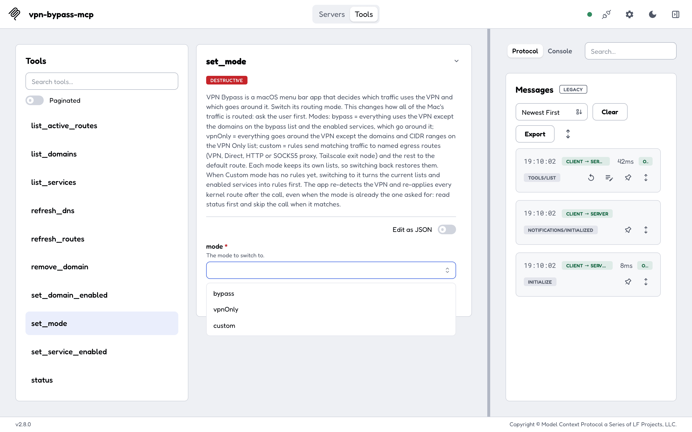
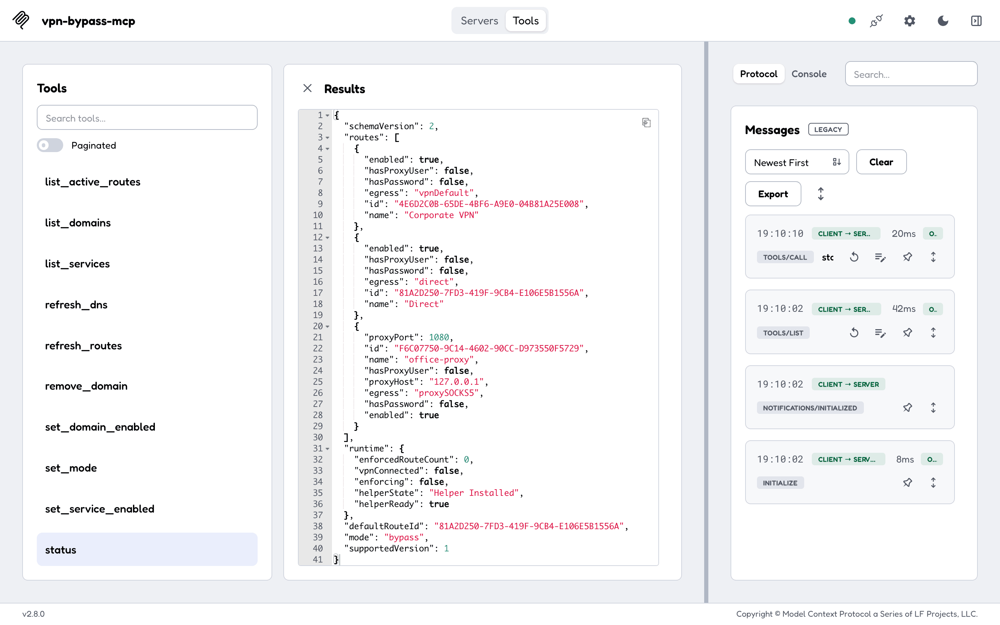
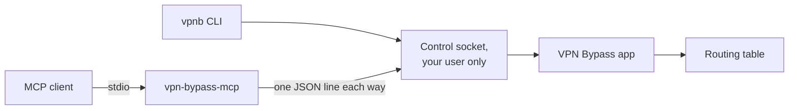

---
hide:
  - navigation
---

# VPN Bypass MCP { .vbm-visually-hidden }

  

  
  
  

---

**vpn-bypass-mcp** is an MCP server for [VPN Bypass](https://geiserx.github.io/VPN-Bypass/), the macOS menu bar app that decides which traffic uses the VPN and which goes around it. It lets an AI agent such as Claude Code, Claude Desktop or Cursor read what the app is doing and change its routing, through the same local control socket as the app's `vpnb` command line. Start with [Getting started](getting-started.md), then read the tools in [Usage](usage.md#tools).

Without it, an agent asked why a site still goes through the VPN can only guess from `route` and `netstat` output, and every list change is a click in Settings. With it, the agent asks the app: one tool per app action, the app's own JSON back unchanged, and a read-only mode for when it should only look.

-   :material-download: **[Install](getting-started.md)**

    ---

    One `npx` line, then an `mcpServers` entry for Claude Desktop, Cursor or Claude Code. Needs VPN Bypass open and Node.js 18.

-   :material-play-circle-outline: **[First run](getting-started.md#first-run)**

    ---

    Ask your agent what mode VPN Bypass is in. It calls `status`, and the answer shows whether routes are enforced.

-   :material-tools: **[The 23 tools](usage.md#tools)**

    ---

    Modes, domain lists, services, kernel routes, the log, and Custom-mode routes and rules, with the socket command each one sends.

-   :material-cog-outline: **[Configuration](configuration.md)**

    ---

    Two environment variables: the socket path and read-only mode. Timeouts, and what is never logged.

## What the agent sees

Each tool has a description written for a model that has never seen the app, and MCP hints that say which tools change nothing and which are destructive. Every tool with its arguments is in [Usage](usage.md#tools).

## Read versus change

- 8 tools only read: `status`, `get_logs`, `list_domains`, `list_services`, `get_service`, `list_active_routes`, `custom_list_routes`, `custom_list_rules`. The other 15 change something: a list, a service, a route, a rule or the mode.
- `VPN_BYPASS_MCP_READ_ONLY=1` registers only the 8 read tools. An unset or empty value, `0`, `false` or `no` (in any case, with spaces trimmed) leaves it off; any other value turns it on, so a typo never exposes the write tools. See [Configuration](configuration.md).
- Every tool carries `readOnlyHint`, `destructiveHint` and `idempotentHint`, so a client can ask you before a destructive call such as `set_mode`, `remove_domain` or `clear_routes`.

## How it runs

- Your MCP client starts the server as a local process and talks to it over stdio. The server opens no network port.
- Each tool call is one request to the app's control socket in `~/Library/Application Support/VPNBypass/`, and the answer is the app's JSON, unchanged. The app accepts only your own macOS user.
- A change is saved before the app answers; the kernel routes follow in the background. Read `list_active_routes` or `get_logs` a few seconds later to see the effect ([What happens after a change](usage.md#what-happens-after-a-change)).
- The domain, service, active-route, refresh and log tools need VPN Bypass 4.9.0 or newer. `status`, `set_mode` and the Custom-mode tools work with older versions ([which tools need 4.9.0](usage.md#which-tools-need-vpn-bypass-490)).
- The app, its `vpnb` command line and where this server is listed: [Related projects](related.md).

## What it does not do

- It does not route anything itself. VPN Bypass does the routing; with the app closed, every tool answers `VPN Bypass is not running; start the app`.
- It runs on macOS only, because the app does.
- It has no HTTP transport and no remote access: it reaches the app on the Mac it runs on, as the user it runs as.
- It never returns a proxy password. A password goes to the app in a separate field, and the server never echoes or logs it.

## Privacy

- The server talks to the local control socket and nothing else: no telemetry, no update check. The npm package downloads the release binary from GitHub once, at install, and checks it against the release's `checksums.txt`.
- It logs one start line to stderr (version, tool count, read-only or not, socket path) and no tool arguments.
- What the tools return (your domain lists, routes and the app's log) goes to the model your MCP client uses. Read-only mode limits what the agent can change, not what it can read.

## Getting help

- A tool answered with an error: the [Errors](usage.md#errors) table says what each one means.
- A bug or a question about the server: open an [issue](https://github.com/GeiserX/vpn-bypass-mcp/issues). A problem with the routing itself, such as a domain that still goes through the VPN, belongs to [VPN Bypass](https://github.com/GeiserX/VPN-Bypass/issues).
- To report a security problem, follow the [security policy](https://github.com/GeiserX/vpn-bypass-mcp/blob/main/SECURITY.md) and do not open a public issue.
- What changed between versions is on the [Releases](https://github.com/GeiserX/vpn-bypass-mcp/releases) page. To build it or send a fix, read [Development](development.md).

## License

vpn-bypass-mcp is released under the [MIT](https://github.com/GeiserX/vpn-bypass-mcp/blob/main/LICENSE) license.
